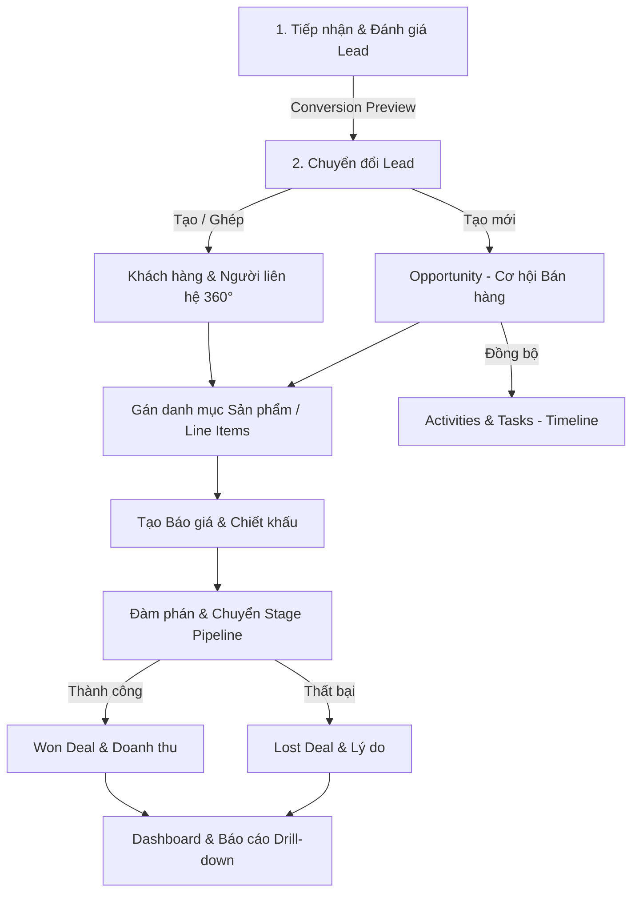

# SalesFlow CRM — Luồng Hệ Thống & Tài Liệu Q&A Phát Triển Tính Năng (Trao Đổi BA)

---

## PHẦN 1: TÍNH NĂNG VÀ LUỒNG FLOW HỆ THỐNG ĐÃ HOÀN THÀNH

### 1. Danh sách tính năng cốt lõi đã triển khai
- **Quản lý Lead & Đánh giá**: Tiếp nhận Lead, tính điểm tự động (`Lead Scoring`), gán nhãn, thao tác hàng loạt (`Bulk Actions`).
- **Chuyển đổi Lead & Chống trùng**: Xem trước và ghép nối Company / Contact / Opportunity (`Conversion Preview & Deduplication`).
- **Hồ sơ Khách hàng 360°**: Quản lý Doanh nghiệp (`Company`) & Người liên hệ (`Contact`), sơ đồ cây quan hệ (`Relationship Map`), gộp bản ghi trùng (`Merge`).
- **Cơ hội Bán hàng & Sản phẩm**: Quản lý Cơ hội (`Opportunity`), danh mục sản phẩm (`Line Items`), phân loại dự báo (`Forecast Category`), ràng buộc stage bắt buộc.
- **Báo giá & Chiết khấu**: Tạo Báo giá (`Quote`) từ Opportunity, tự động tính tổng tiền, thuế VAT (8-10%), chiết khấu toàn đơn và chiết khấu dòng.
- **Công việc & Tương tác**: Theo dõi Hoạt động (`Activity` cuộc gọi/họp/demo/email), Công việc (`Task`), Checklist, Comment và Cảnh báo quá hạn SLA.
- **Báo cáo & Phân tích**: Biểu đồ KPI, Funnel chốt deal, đào sâu dữ liệu (`Drill-down`), lưu bộ lọc (`Saved Filters`), Báo cáo chất lượng dữ liệu (`Data Quality Dashboard`).
- **Vận hành Platform**: Phân quyền 5 cấp (`RBAC & Data Scope`), Nhật ký audit thay đổi dạng Drawer, Realtime Log Console qua WebSockets Reverb.

### 2. Luồng Flow dữ liệu End-to-End

---

## PHẦN 2: BỘ CÂU HỎI VÀ GIẢI ĐÁP PHÁT TRIỂN TÍNH NĂNG (DÙNG CHO BA)

### ❓ CÂU HỎI 1: "Nhìn vào dự án CRM trên thì cần phát triển thêm những tính năng gì để dự án thêm nổi bật khi mang đi review/chào bán cho các doanh nghiệp B2B?"

### ❓ CÂU HỎI 2: "Những tính năng tự động hóa nào có thể triển khai để giúp giảm bớt tối đa thao tác thủ công cho người dùng (Sales / Manager)?"

