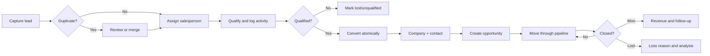
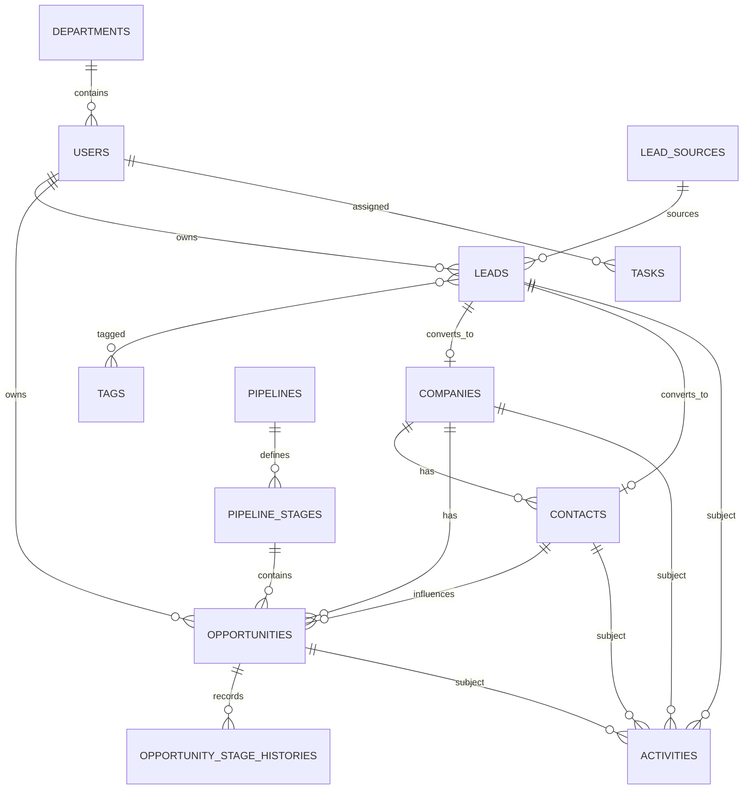

# SalesFlow CRM — Architecture & Delivery Plan

## 1. Business analysis and module map

SalesFlow centralises the sales lifecycle: capture and qualify a lead, assign an owner, convert the lead to a company/contact, create an opportunity, advance it through a configurable pipeline, schedule follow-ups, and measure outcomes. Data visibility is scoped by ownership/department and elevated by explicit permissions.

| Domain | Responsibility | MVP |
|---|---|---|
| Auth & Users | Login, password reset, active-account check, API tokens | Yes |
| Roles & Departments | RBAC, teams, data scope | Yes |
| Leads | CRUD, filters, assignment, conversion, audit | Yes |
| Companies & Contacts | Customer records and relationships | Yes |
| Pipelines & Opportunities | Stages, values, weighted forecast, board | Yes |
| Activities & Tasks | Follow-ups, ownership, due dates | Schema/foundation |
| Notifications | Database/email/broadcast delivery | Foundation |
| Import/Export | Chunked queue workflow and downloadable results | Roadmap |
| Reports | Funnel, revenue, sales performance | Dashboard MVP |
| Attachments & Audit | Private polymorphic files and immutable change log | Audit foundation |

## 2. Main business flow

Runtime flow: `Route -> Livewire -> Service/Action -> Repository -> Eloquent -> PostgreSQL`. Side effects leave the transaction through events/listeners and queued jobs. Realtime changes use authenticated private Reverb channels.

## 3. ERD

Application domain keys use auto-incrementing `BIGINT` values, foreign keys are indexed, customer-facing records use soft deletes, and monetary fields use fixed precision decimals. `activities`, `tasks`, and `attachments` use polymorphic subjects.

Lead taxonomy is delivered in dependency order: P3-01 creates `lead_sources` and `tags`; P3-02 creates `leads` and the `lead_tag` many-to-many pivot so every foreign key references an existing table during a clean migration.

The Lead aggregate uses nullable `owner_id` and `department_id` for unassigned intake while preserving compatibility with backend data scopes. Status and priority are typed backed enums, contact duplicates remain allowed until the P3-08 review workflow, and Soft Delete preserves tag membership for restoration. Conversion target foreign keys remain deferred until Company and Contact schemas exist.

## 4. Delivery plan and estimate

| Phase | Deliverable | Estimate |
|---|---|---:|
| 1 | Bootstrap, Docker, auth, shell UI, architecture | 8 man-days |
| 2 | Users, departments, roles and permissions | 7 man-days |
| 3 | Full lead lifecycle including conversion | 12 man-days |
| 4 | Companies, contacts and attachments | 10 man-days |
| 5 | Pipelines, opportunity Kanban and realtime | 14 man-days |
| 6 | Activities, tasks, calendar and reminders | 10 man-days |
| 7 | Dashboard, reports and exports | 10 man-days |
| 8 | Imports, audit hardening and notifications | 9 man-days |
| 9 | Accessibility, security, performance, CI/CD | 10 man-days |
| **Total** | One experienced engineer, excluding feedback delays | **90 man-days** |

## 5. Technical risks

- Realtime ordering conflicts on a busy Kanban board: use version checks, idempotent commands and server-authoritative rollback.
- Large imports/exports: stream/chunk, cap file size, persist row errors, and never process in the web request.
- Data-scope leaks: repository scope plus policies/API resources; hiding UI controls is not authorization.
- Reporting load: indexed aggregates first, then cached snapshots/read models as volume grows.
- Flux Pro boundaries: this project only depends on the licensed free package and implements missing patterns with Blade/Alpine/Tailwind.
- Docker persistence and permissions: named volumes, health checks and an explicit entrypoint prevent race conditions.

## 6. MVP completion criteria

Docker starts healthy; a seeded user can log in; backend permissions are enforced; dashboard reads real data; leads can be searched, created, edited, assigned and safely deleted; companies/contacts/opportunities are persisted and related; opportunity weighted value is calculated server-side; stages render as a pipeline board; audit entries are generated; core feature tests, formatting and frontend production build pass.
